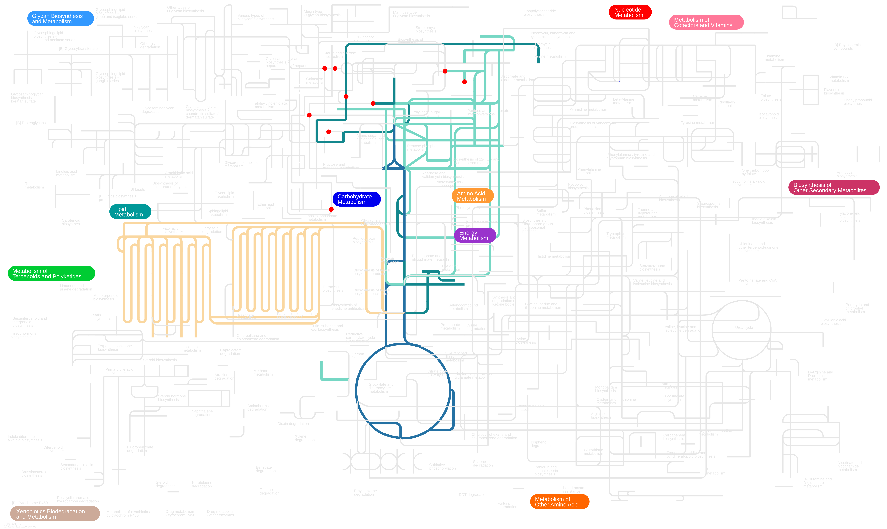

# ipathapy
A package to create metabolic pathmaps with ipath3

## About

**ipathapy** provides an easy access to [ipath3](https://pathways.embl.de/) that allows users to highlight metabolites, genes or pathways in a metabolic network. 
ipathpy supports you in creating these maps by 

- Retrieving the required KEGG IDs of compounds from [KEGG](https://www.kegg.jp/) from molecular formulas. 
- Coloring to encode quantitive data in metabolic maps.  
- Providing several useful helper functions


## Main features 

- Standard filtering of data (`ipathapy.preprocessing`)
- API-retrieval KEGG IDs with molecular formulas or names, including batch retrieval (`ipathapy.kegg`)
- Versatile coloring + size adjustment to encode quantitive changes/values associated with a KEGG entitiy (`ipathapy.layout`)
- Formatting in ipath3 format + direct access to ipath3 via POST method (*Due to deactivation of POST Access by ipath3 not applicable*) (`ipathapy.ipath`)

## Installation 

With pypi in your favourite python environment: 

```bash 
    pip install -e git+https://github.com/annorerio/ipathapy.git
```

Requirements (will be installed during installation): numpy, pandas, requests, tqdm, scanpy

## Example 

### Preprocessing 
```python
import ipathapy as ipath
import pandas as pd 

df = pd.DataFrame(
    {
    'ions': {0: 'C5H5N5-H', 1: 'C6H12O6-H', 2: 'C4H6O4-H'},
    'scores': {0: 3.7321227, 1: 26.354689, 2: -1.7803773},
    'logfoldchanges': {0: 0.3070414, 1: 0.51227486, 2: -6.6116753},
    'pvals': {0: 0.0001898730023755, 1: 4.535010108462715e-153, 2: 0.075014248841717},
    'pvals_adj': {0: 0.0003114967227913, 1: 3.937716094177382e-152, 2: 0.1019277579681346}
    }
    )

# filter for only significantly enriched metabolites + add molecular formula
# The ion C4H6O4-H is removed, because it does not meet the p-value cutoff criteria 
df = ipath.preprocess.parse_ranked_ions(df, 
                                        pcutoff = 1e-3,
                                        changecutoff = 0,  # Only show enriched metabolites 
                                        ion_column = 'ions',
                                        logchange_column='logfoldchanges', 
                                        pval_column = 'pvals_adj'
                                        )

```
 
### KEGG annotation 

```python
# Simple example, starting from here
molformulas = [
    'C5H5N5', # Adenine and others 
    'C6H12O6', # Hexoses
    'C4H6O4', # Water 
]

molformula_keggID = ipath.kegg.batch_retrieval(molformulas)
keggID_name = ipath.kegg.all_compounds()
df_annotated = pd.merge(molformula_keggID, keggID_name, on = 'id', how = 'left')
```

```python
# Full workflow
df_annotated = ipath.kegg.annotate_data(df)

# Fraction of ions that could not be annotated with KEGG 
df_annotated['id'].isna().sum()/df_annotated.shape[0]
```

### Layout 
```python
# You can specify an arbitrary number of colors 
# You can select between normalization None, Log-scaling, Z-factor scaling and Rank scaling

colors = ipath.layout.color(df_annotated, 
                            column = 'pvals_adj', 
                            colors = [(255,0,0), (0,0,255)], 
                            normalization=None
                            )
df_annotated['colors'] = colors 

# You can change the size of the entities
sizes = ipath.layout.size(df_annotated, 
                          column = 'logfoldchanges',
                          minsize = 2, 
                          maxsize = 10, 
                          normalization=None
                          )
df_annotated['sizes'] = sizes
 
```

### ipath

```python 
# Generate simple input for ipath3
selection = ipath.ipath.make_ipath_selection(df_annotated['id'], df_annotated['colors'])
print(selection)

# Post selection directly to ipath3 and receive .svg image as response 
# All parameters that can be tuned in ipath3 can be passed to the method 
# Currently, the access to the ipath3 POST method is deactivated. 
response = ipath.ipath.post(selection = selection)


# Instead Save to file ipath_input.txt that can be uploaded to https://pathways.embl.de/tools.cgi
ipath.ipath.make_ipath_selection(df_annotated['id'], df_annotated['colors'], save = 'ipath_input.txt')

```

```python 
# Advanced
# Highlight important metabolic pathways in addition to the previous example and color them individually 

highlights = [
    {'keggID': '00010','color': '#13878D', 'width':10}, # Glycolysis
    {'keggID': '00030','color': '#76D7C4', 'width':10}, # Pentose Phosphate Pathway
    {'keggID': '00020','color': '#2471A3', 'width':10}, # TCA cycle 
    {'keggID': '00061','color': '#FAD7A0', 'width':10}, # Fatty acid degradation
    {'keggID': '00071','color': '#FAD7A0', 'width':10}  # Fatty acid synthesis
    ]


ipath.ipath.make_ipath_selection(df_annotated['id'], df_annotated['colors'], save = 'ipath_input.txt', highlight = highlights)


```
 


### Manually 

Upload file to [ipath3](https://pathways.embl.de/tools.cgi) in `Direct submission` and specify further parameters. 

## Resources 

**[ipath3](https://pathways.embl.de/)**

[Darzi Y et al. (2018)](https://doi.org/10.1093/nar/gky299) Nucleic Acids Res. 46(W1): W510-W513 iPath3.0: interactive pathways explorer v3. 


